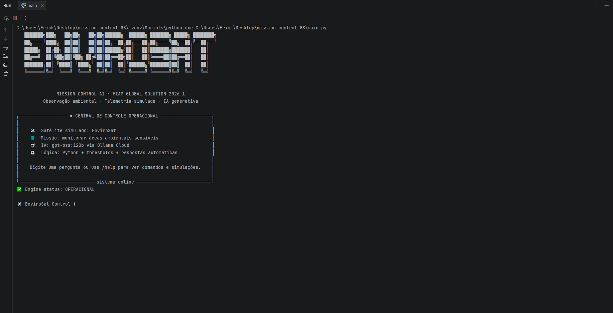
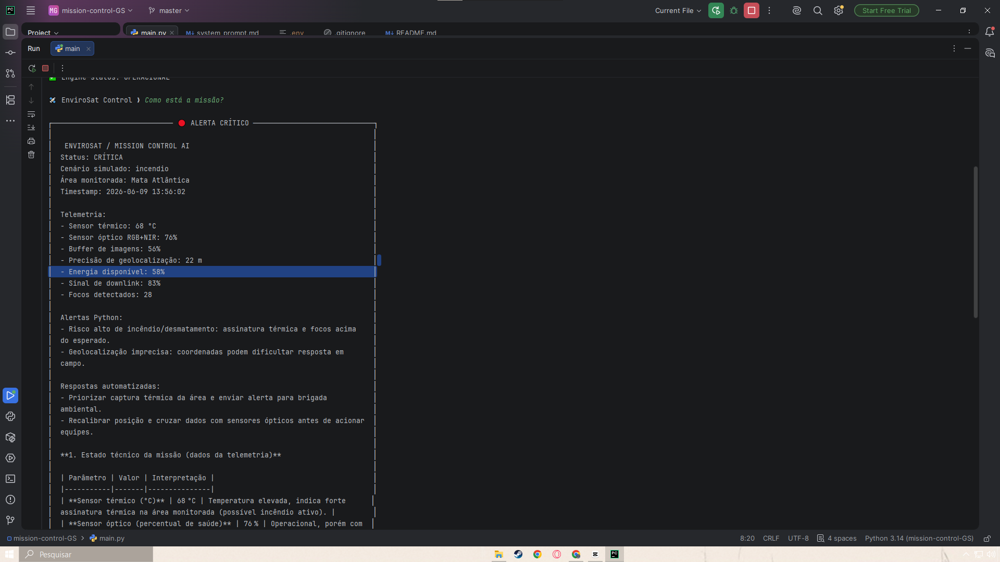

# 🚀 Mission Control AI — EnviroSat

## Integrantes
- Erick Banhos de Castro — RM: 572131 — Turma: 1CCR
- Erick Yu Xiang Li — RM: 569305 — Turma: 1CCR
- Júlia Lemos de Souza — RM: 569089 — Turma: 1CCR

## O que o projeto faz
O Mission Control AI — EnviroSat é uma CLI em Python que simula a telemetria de um satélite de observação ambiental. O sistema gera dados como temperatura do sensor térmico, energia disponível, sinal de downlink, buffer de imagens e focos detectados.

A lógica Python avalia thresholds, gera alertas e dispara respostas automatizadas. Em seguida, a IA generativa via Ollama Cloud interpreta os dados em linguagem natural e conecta cada anomalia orbital ao impacto terrestre, como combate a queimadas, resposta de brigadas ambientais e monitoramento de áreas protegidas.

## Persona atendida
A persona principal é um operador de centro de controle ambiental, responsável por acompanhar anomalias do satélite e transformar alertas técnicos em decisões rápidas para equipes de campo.

## Proposta de valor / modelo de negócio
Órgãos ambientais, seguradoras, empresas de compliance ambiental e governos estaduais podem usar o EnviroSat para reduzir o tempo entre a detecção orbital de um risco e a ação em terra. O valor está em transformar telemetria bruta em decisão operacional clara.

## Tecnologias utilizadas
- Python 3.14
- Ollama Cloud API
- Modelo: gpt-oss:120b
- Bibliotecas: ollama, python-dotenv, rich, pyfiglet

## Como executar
1. Clone o repositório.
2. Crie o ambiente virtual:
   ```bash
   python -m venv .venv
   ```
3. Ative o ambiente virtual:
   ```bash
   .venv\Scripts\activate
   ```
   No Linux/Mac:
   ```bash
   source .venv/bin/activate
   ```
4. Instale as dependências:
   ```bash
   pip install -r requirements.txt
   ```
5. Crie um arquivo `.env` na raiz com:
   ```bash
   OLLAMA_API_KEY=sua_chave_aqui
   ```
6. Execute:
   ```bash
   python main.py
   ```

## Comandos da CLI
- `/help` — mostra os comandos disponíveis
- `/status` — gera um ciclo de telemetria e mostra o diagnóstico
- `/about` — explica o projeto
- `/clear` — limpa a tela
- `/exit` — encerra o sistema

## Cenários de teste demonstrados
1. Operação normal — parâmetros dentro do range.
2. Incêndio/queimada — temperatura e focos detectados elevados.
3. Energia baixa — ativa modo economia.
4. Comunicação degradada — prioriza imagens críticas e nova janela de downlink.

Frases para testar:
```text
simule incêndio na Amazônia Legal
simule energia baixa
simule falha de comunicação
status normal
```

## System Prompt
O system prompt está em `prompts/system_prompt.md` e orienta a IA a responder como analista de missão EnviroSat, sempre conectando telemetria, alerta técnico e impacto terrestre.

## Demonstração



## Vídeo de demonstração
🎥 [Assistir demonstração no YouTube](https://youtu.be/yW-E-CgSOr4)

## Limitações conhecidas
- Os dados são simulados, não coletados de satélites reais.
- A análise generativa depende da chave da Ollama Cloud configurada no `.env`.
- O sistema não possui dashboard web; a visualização é feita via terminal.